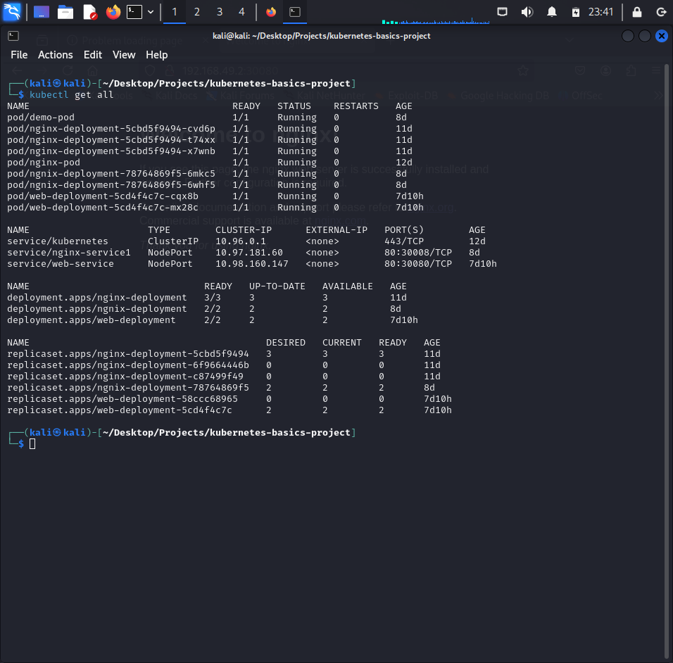
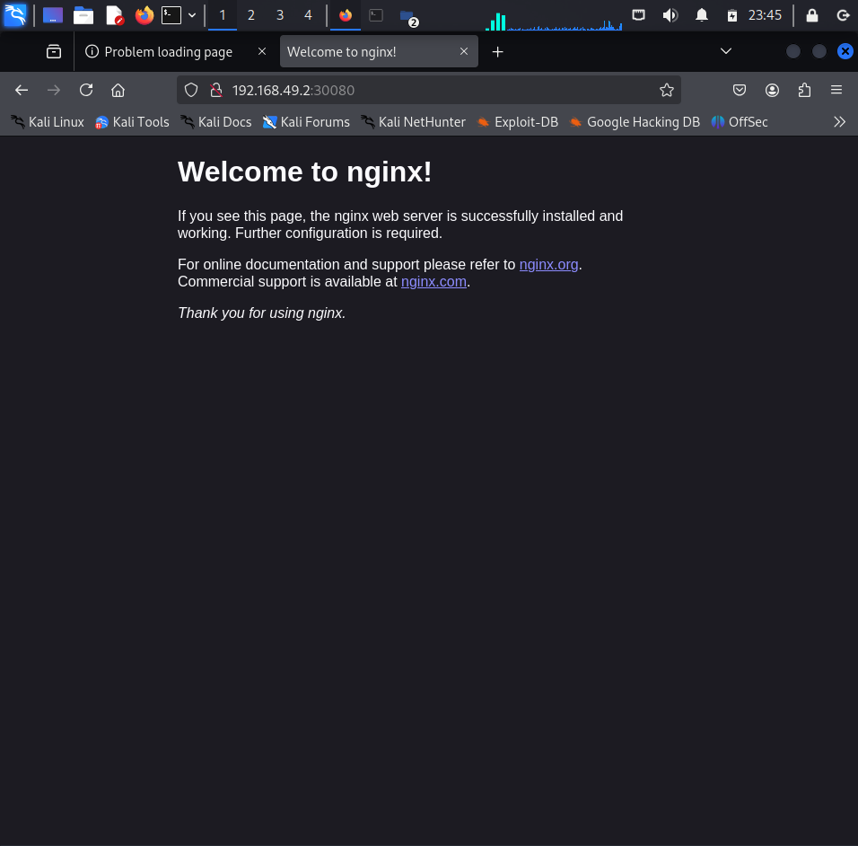

# 🚀 Kubernetes Basics Project

## 📌 Description
Simple web application deployed on Kubernetes with:
- **Deployment** for self-healing and scaling
- **Service** (NodePort) for external access
- **ConfigMap** for non-sensitive configuration
- **Secret** for sensitive data (API Keys)

## 🛠️ Technologies Used
- Kubernetes (Minikube)
- kubectl
- YAML
- Nginx

## 📸 Screenshots

### Kubernetes Resources


### Web Application


## 🧩 Project Structure
kubernetes-basics-project/

├── configmap.yaml # Application configuration

├── secret.yaml # Sensitive data (base64 encoded)

├── deployment.yaml # Web deployment with 2 replicas

└── service.yaml # NodePort service for external access


## 🚀 How to Deploy

### Prerequisites
- Minikube installed
- kubectl installed

### Steps
```bash
# 1. Start Minikube
minikube start

# 2. Apply all resources
kubectl apply -f .

# 3. Get Minikube IP
minikube ip

# 4. Access the application
# Open http://<minikube-ip>:30080 in your browser


##🔒 Security Best Practices
- Sensitive data stored in Secrets (base64 encoded)
Non-sensitive configuration in ConfigMaps
- Environment variables used to inject configuration into Pods
##🎯 Key Features
- Self-healing: Pods automatically restarted if failed
- Scalable: Easy to scale replicas in deployment.yaml
- Secure: Sensitive data separated from application code
- Accessible: External access via NodePort service
##💡 Future Improvements
- Add Health Checks and Liveness Probes
- Implement Ingress for better routing
- Use Helm for templating
- Deploy on AWS EKS


